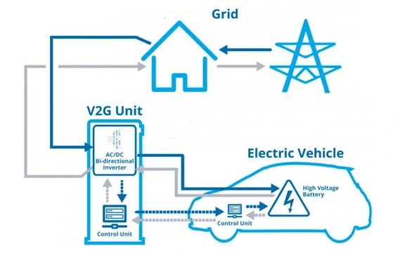

# V-G
Regulation strategies for electric vehicle-grid interaction



[](https://github.com/BenjaminChen1024 "Author")
[](LICENSE)
[](https://github.com/RichardLitt/standard-readme)
<br></br>

## Table of Contents
- [V-G](#v-g)
  - [Table of Contents](#table-of-contents)
  - [Background](#background)
  - [Install](#install)
  - [Usage](#usage)
  - [TODO](#todo)
  - [Related Efforts](#related-efforts)
  - [License](#license)

## Background

<br></br>

## Install

- [`MATLAB R2022a`](https://ww2.mathworks.cn/products/matlab.html)
- [`YALMIP R20210331`](https://github.com/yalmip/YALMIP)
- [`CPLEX 12.10`](https://www.ibm.com/products/ilog-cplex-optimization-studio/cplex-optimizer)
  <br></br>

## Usage

```bash

```
  <br></br>

## TODO
  <br></br>


## Related Efforts
  <br></br>


## License
[MIT © Richard McRichface.](https://github.com/BenjaminChen1024/V-G/blob/master/LICENSE)
  <br></br>
